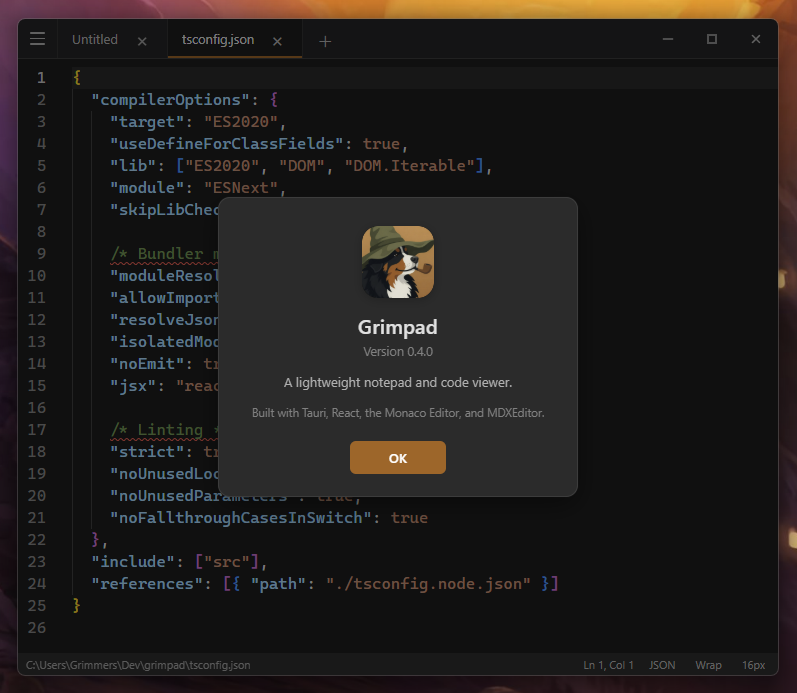

<p align="center">
  
</p>

<h1 align="center">Grimpad</h1>

<p align="center">
  A modern, lightweight notepad for Windows- tabs, syntax highlighting, and live markdown. Developed with AI.
</p>

<p align="center">
  
</p>

## What is Grimpad?

A Fluent-style notepad in the spirit of [Notepads](https://github.com/0x7c13/Notepads): fast to open, easy on the eyes, and good enough for notes *and* reading scripts. Under the hood it uses the [Monaco Editor](https://microsoft.github.io/monaco-editor/) (the same engine as VS Code) plus [MDXEditor](https://mdxeditor.dev/) for live markdown.

It is a personal project, still in **beta** (`0.5.0`). MIT licensed.

## Features

* **Tabs**
* **Syntax Highlighting**
* **Markdown**
* **Session restore**
* **Dark Theme**
  
## Downloads

Get the latest Windows x64 build from **[Releases](https://github.com/Grimstuff/grimpad/releases/latest)**.

Needs [WebView2](https://developer.microsoft.com/microsoft-edge/webview2/) (already on most Windows 10/11 PCs).

Windows will complain since the exe is unsigned. More Info allows a bypass. 

## Shortcuts

| Shortcut | Action |
|----------|--------|
| `Ctrl+N` / `Ctrl+T` | New tab |
| `Ctrl+O` | Open |
| `Ctrl+S` / `Ctrl+Shift+S` | Save / Save as |
| `Ctrl+W` | Close tab |
| `Ctrl+Tab` / `Ctrl+Shift+Tab` | Next / previous tab |
| `Ctrl+1`…`9` | Jump to tab |
| `Ctrl+F` / `Ctrl+H` | Find / replace |
| `Ctrl+G` | Go to line |
| `Ctrl++` / `-` / `0` | Zoom in / out / reset |

## Privacy

Session state lives only on your machine:

`%AppData%\com.grimmers.grimpad\session.json`
It can include full buffer text for unsaved tabs (plaintext, like Notepad / VS Code hot-exit). But all local machine.

## Build from source

Requires **Node.js 20+**, **Rust** (stable), and [Tauri prerequisites](https://v2.tauri.app/start/prerequisites/).

```bash
git clone https://github.com/Grimstuff/grimpad.git
cd grimpad
npm install
npm run tauri dev     # development
npm run tauri build   # release exe + installers
```

## License

MIT — see [LICENSE](./LICENSE).

Coded with use of AI.
